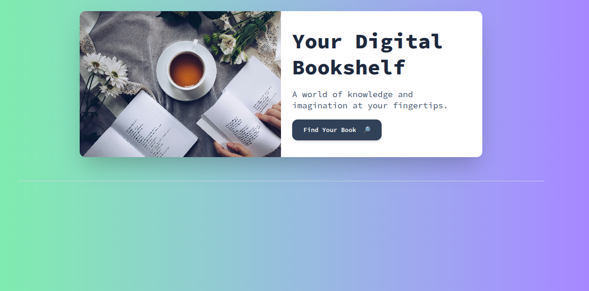

# OpenReads 📚

A dynamic web application that serves as your digital bookshelf, allowing you to search and discover books from the Open Library database.



## Features ✨

- **Intuitive Search Interface**: Easy-to-use search functionality to find books
- **Real-time Results**: Instant display of book search results
- **Rich Book Information**: View book covers, titles, and authors
- **Responsive Design**: Works seamlessly on both desktop and mobile devices
- **Modern UI**: Clean and attractive interface with smooth animations

## Technologies Used 🛠️

- HTML5
- JavaScript (Vanilla)
- TailwindCSS
- Open Library API
- Google Fonts

## Getting Started 🚀

1. Clone the repository:
```bash
git clone https://github.com/youness404/openReads
```

2. Open the project directory:
```bash
cd openReads
```

3. Open `index.html` in your browser or use a live server.

## How to Use 💡

1. Click the "Find Your Book" button to open the search modal
2. Enter a book title in the search field
3. Click "Search" or press Enter
4. Browse through the search results displaying book covers, titles, and authors

## API Integration 🔗

OpenReads uses the [Open Library API](https://openlibrary.org/developers/api) to fetch book information. The application makes requests to:
```
https://openlibrary.org/search.json?q={query}
```

## Contributing 🤝

Contributions, issues, and feature requests are welcome!

## License 📝

This project is open source .Feel free to modify 

---

Made with ❤️ !